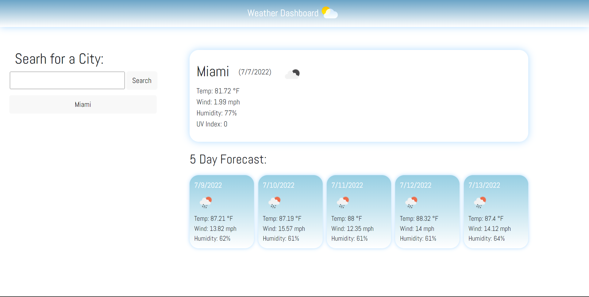

# Weather Dashboard
URL: https://smillkaa.github.io/weather-dashboard/

## Purpose
Weather Dashboard is a website with a form input which allows the user to search for a city and receive information about the current and future weather conditions for that city and that city is added to the search history.

## Technologies used
- JavaScript
- CSS
- HTML

Front page display
